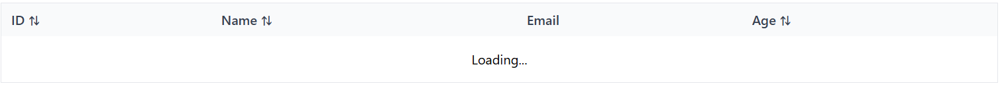
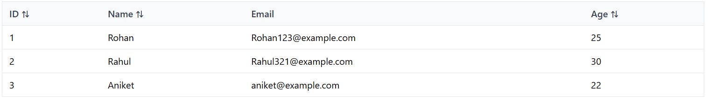
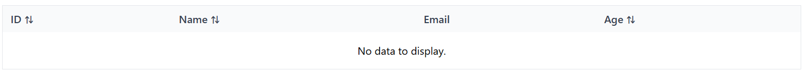
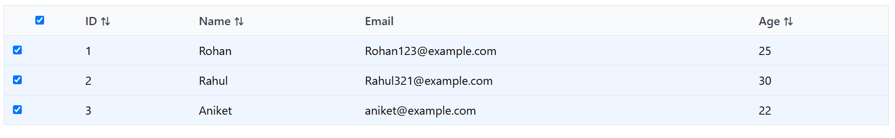
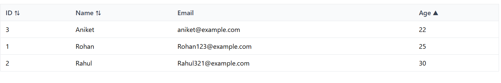

# React Component Assignment

## Overview
In this project, I created two reuseable components using **React**, **Typescript**, and modern design patterns, which I documented on Storybook. The components were created with future growth and expansion in mind, facilitating their easy adoption or integration into larger scale projects.

The components include:

1. **InputField** – An all-purpose input component with optional validation, different input types, and sizes.
2. **DataTable** – A data table with sortable columns, selectable rows, and loading and empty states.

---

## Components

### **1. InputField**
I created an all-purpose input component to address the following needs:

- **Features implemented:**
  - Text input with label, placeholder, helper text, and error messages.
  - States: `disabled`, `invalid`, `loading`.
  - Variants: `filled`, `outlined`, `ghost`.
  - Sizes: `small`, `medium`, `large`.
  
- **Approach:**
  - Used **TypeScript** for typing props (`InputFieldProps`) for type safety.
  - Password toggle handled with a local `useState`.
  - Conditional styling based on props for disabled, invalid, and variant states.
  - Designed for **scalability** by allowing additional variants or states to be easily added in the future.
  
- **Storybook:** 
  - Documented with stories showing default, password toggle, disabled, error, and loading states.

---

### **2. DataTable**
I built a generic and reusable table component for displaying tabular data:

- **Features implemented:**
  - Displays tabular data based on passed `columns` and `data`.
  - Column sorting for sortable columns.
  - Row selection (single/multiple) with callback.
  - Loading state and empty state messages.
  - Clean and modern styling using Tailwind CSS.
  
- **Approach:**
  - Used **TypeScript generics** (`DataTable<T>`) to make the table flexible for any data type.
  - Internal state for sorting and row selection.
  - Simple, scalable logic for sorting toggle and row selection.
  
- **Storybook:** 
  - Documented with stories for default, loading, empty, selectable rows, and sorting behavior.

---

## Setup Instructions

# Clone the repository
git clone https://github.com/Suryadev78/Frontend-assignment.git
cd frontend-assignment

# Install dependencies
npm install

# Run the app
npm run dev

# Run Storybook
npm run storybook

# Run tests
npm test

## StoryBook Preview 
You can view the live storybook deployment of components here : 
[https://68b08f1ee058ca33850a6aff-npeehlnkdo.chromatic.com/](https://68b08f1ee058ca33850a6aff-npeehlnkdo.chromatic.com/)

## Component Previews
You can view the Preview of All components below : 
**InputField**

**DataTable**

